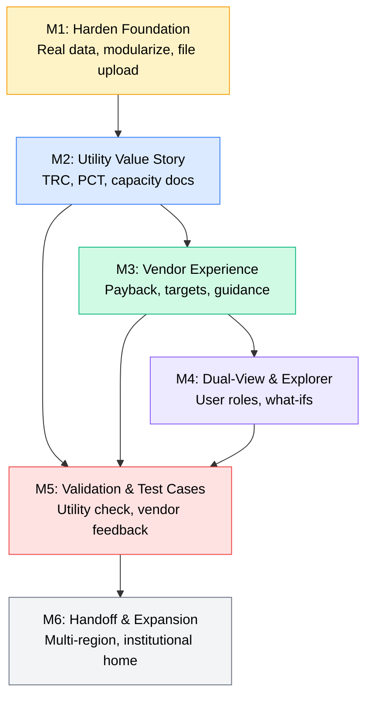

# 🗺️ Development Roadmap: Current State → End State

> **Living Document** — Update as milestones are completed, priorities shift, or new requirements emerge.
>
> **Last Updated:** 2026-08-06
> **Cross-references:** [needs_and_gaps.md](./needs_and_gaps.md) · [glossary.md](./glossary.md) · Project Abstract & Phased Plan

---

## How to Comment on This Document

Use the following conventions to annotate roadmap items with decisions, corrections, or context. These comments are preserved as part of the living document and will be incorporated into planning.

### Decision Tags

Mark any roadmap item with one of these tags to indicate your intent:

| Tag | Meaning | Example |
|-----|---------|--------|
| `🔨 BUILD` | We will implement this ourselves in code | Core feature we control |
| `📦 EXTERNAL` | We expect to receive this from an external source (utility partner, dataset, collaborator) | CWFT data from Southern Co. |
| `🔀 MODIFY` | The item is directionally right but the scope or approach needs to change | See attached comment |
| `❌ ABANDON` | We're dropping this — not needed, out of scope, or not feasible | Feature creep, not worth it |
| `⏸️ DEFER` | Not abandoning, but pushing beyond current phase/budget | Phase 2+ or future grant |
| `❓ DISCUSS` | Needs team discussion before deciding | Bring up at next meeting |

### Inline Comments

Add your notes directly below any roadmap item using this format:

```markdown
- [ ] Some roadmap item
  > **[Your Name, Date]:** Your comment here. Can be multiple lines.
  > This will be clearly visible as a user annotation.
```

For example:
```markdown
- [ ] Replace or calibrate CWFT
  > **[Justin, 2026-08-05]:** 📦 EXTERNAL — Justin has a preliminary CWFT shape from
  > the 2024 IRP filing. Need to validate format and convert to 8760.
```

For top-level milestone comments, use the same blockquote pattern after the milestone header.

### Section-Level Notes

If you want to add a broader note about an entire milestone, add it in a callout block:

```markdown
> [!NOTE]
> **[Your Name, Date]:** Overall thoughts on this milestone...
```

---

## Table of Contents

1. [From → To: State Summary](#1-from--to-state-summary)
2. [Guiding Principles](#2-guiding-principles)
3. [Milestone Map](#3-milestone-map)
4. [Milestone 1: Harden the Foundation](#milestone-1-harden-the-foundation)
5. [Milestone 2: Complete the Utility Value Story](#milestone-2-complete-the-utility-value-story)
6. [Milestone 3: Build the Vendor / Product Development Experience](#milestone-3-build-the-vendor--product-development-experience)
7. [Milestone 4: Dual-View Architecture & Explorer](#milestone-4-dual-view-architecture--explorer)
8. [Milestone 5: Validation, Calibration & Test Cases](#milestone-5-validation-calibration--test-cases)
9. [Milestone 6: Handoff Readiness & Expansion](#milestone-6-handoff-readiness--expansion)
10. [Dependency Map](#7-dependency-map)
11. [Open Design Decisions](#8-open-design-decisions)
12. [Progress Tracking](#9-progress-tracking)

---

## 1. From → To: State Summary

| Dimension | **Current State** | **End State** |
|-----------|-------------------|---------------|
| **Users** | Single undifferentiated user | Three distinct views: Utility, Vendor, Researcher |
| **Data** | Placeholder/mock CWFT, synthetic load profiles, 2-state Cambium coverage | Real CWFT (or calibrated proxy), real EnergyPlus building models, full Southeast state coverage |
| **Cost Tests** | RIM only | RIM + TRC + customer payback/ROI |
| **Vendor Features** | None | Cost-of-ownership, payback period, performance targets, improvement guidance, parametric what-ifs |
| **Explorer** | None (CSV-only input) | In-app what-if modification, file upload, pre-loaded example buildings |
| **Visualizations** | Utility/grid-oriented only | Audience-specific: utility dashboards, vendor product dashboards, researcher detail views |
| **Architecture** | Monolithic single-file (1,957 lines) | Modular multi-file with config, tests, and clear separation of concerns |
| **Credibility** | Unvalidated against utility internals | Validated against ≥1 utility's internal calculations; feedback from ≥1 vendor/researcher |

---

## 2. Guiding Principles

These principles should guide sequencing and trade-off decisions:

1. **Credibility before features.** Replace placeholders with real or defensible data before adding new capabilities. A tool that gives wrong answers beautifully is worse than a simple tool that gives right answers.

2. **One complete story at a time.** Each milestone should produce something demonstrable and useful to at least one audience — don't leave half-finished features scattered across the codebase.

3. **Utility-side first, vendor-side second.** The project abstract positions utility credibility as the prerequisite for vendor trust. The utility value story (capacity, RIM, TRC) must be solid before the vendor experience is built on top of it.

4. **Build the researcher mode implicitly.** Rather than building a separate "researcher mode" from scratch, build the utility and vendor modes with full transparency. The researcher mode is essentially "show everything" — it emerges naturally from the union of the other two views.

5. **Keep it runnable at every step.** Every milestone should leave the tool in a working, deployable state. No long refactors that break the app for weeks.

---

## 3. Milestone Map

```
Phase 1 (Current Budget / Current Year)
━━━━━━━━━━━━━━━━━━━━━━━━━━━━━━━━━━━━━━━

  M1: Harden the Foundation
  ├── Real data inputs (CWFT, load profiles, state coverage)
  ├── Code modularization
  └── File upload UX

          ↓

  M2: Complete the Utility Value Story
  ├── TRC test implementation
  ├── Capacity methodology improvements
  └── Utility-oriented visualization polish

          ↓

  M3: Build the Vendor / Product Dev Experience
  ├── Customer cost-of-ownership & payback
  ├── Performance targets & improvement guidance
  └── Vendor-facing visualizations

          ↓

  M4: Dual-View Architecture & Explorer
  ├── User role selector (Utility / Vendor / Researcher)
  ├── What-if sandbox
  └── Pre-loaded example buildings


Phase 2 (Additional Budget / Future Year)
━━━━━━━━━━━━━━━━━━━━━━━━━━━━━━━━━━━━━━━━

  M5: Validation, Calibration & Test Cases
  ├── Validate against internal utility calculations
  ├── Test with 1-2 real technologies + developers
  └── Usability feedback collection

          ↓

  M6: Handoff Readiness & Expansion
  ├── Multi-region expansion
  ├── Institutional home (NREL, EPRI, other)
  └── Advanced features scoping (Monte Carlo, alt fuels)
```

---

## Milestone 1: Harden the Foundation

> **Goal:** Replace placeholders with real or defensible data, modularize the codebase, and improve file input UX. After this milestone, every number the tool produces should be *directionally credible* even if not yet validated.

**Estimated scope:** Medium-large

### 1.1 Replace or Calibrate CWFT
*Ref: needs_and_gaps.md §3.1*
> **[John, 8/4/2026]:** This will be done by Justin; we should be prepared to continue progress while awaiting his input

- [ ] **Option A (Preferred):** Obtain real CWFT data from Southern Company or a public LOLP proxy
- [ ] **Option B (Fallback):** Build an interactive CWFT builder that lets users define seasonal risk windows, peak hours, and winter/summer weight splits — producing a defensible custom shape
- [ ] Document the methodology, assumptions, and limitations of whichever approach is used
- [ ] Retain the current synthetic generator as a clearly-labeled "demo/illustrative" fallback

### 1.2 Bundle Real Building Load Profiles
*Ref: needs_and_gaps.md §3.2*

- [ ] Source 8,760-hour EnergyPlus outputs for ≥2 representative Southeast buildings (e.g., single-family residential, small multifamily) with:
  - Baseline system (electric resistance or gas furnace + standard AC)
  - Standard heat pump
  - High-efficiency heat pump
- [ ] Package as selectable example profiles in the app (dropdown or file picker)
- [ ] Retain ability for users to upload their own CSVs
- [ ] Document which E+ prototype model, climate zone, and weather file were used

> **[John, 8/4/2026]:** This can be done by me, starting with probably the template HP+TES models and I shoudl also consider bringing in some DOE template buildings.  Let's assume for now, for prototyping, that we're gonna stick to single family res

### 1.3 Expand Cambium State Coverage
*Ref: needs_and_gaps.md §3.3*

- [ ] Download and bundle Cambium data for FL, TN, MS, NC, SC (at minimum MidCase and HighDemandGrowth, planning year 2040)
- [ ] Or: create a documented step-by-step guide for users to download their own, with direct links to NREL Scenario Viewer
- [ ] Consider bundling a small data management utility (list available states/scenarios/years)
> **[John, 8/4/2026]:**  short term we could keep this to GA and AL (and maybe add TN) as long as we keep it very easy to add states in time (but probably not adding value to add other states in the current prototype work stage)

### 1.4 Bundle a Real Weather File
*Ref: needs_and_gaps.md §3.4*

- [ ] Generate and include a 2012 AMY EPW file for Birmingham, AL (WMO 722300) using diyepw
- [ ] Place in `Weather_Data_raw/Baseline/`
- [ ] Document the station-to-region mapping

> **[John, 8/4/2026]:** I think this should be pretty straightforward

### 1.5 Add File Upload Widgets
*Ref: needs_and_gaps.md §3.6*

- [ ] Replace text-input file paths with `st.file_uploader()` for CWFT, load profiles, and weather files
- [ ] Add upload validation: row count check, column detection, data preview
- [ ] Provide downloadable CSV templates

> **[John, 8/6/2026]:** seems like a straightforward request to the AI 

### 1.6 Modularize the Codebase
*Ref: needs_and_gaps.md §6.1*

- [ ] Extract from `app.py` into separate modules:
  - `data_loaders.py` — Cambium ingestion, weather, CWFT, load profiles, column mapping
  - `calculations.py` — avoided costs, NPV, EPC/ELCC, capacity math
  - `billing.py` — URDB billing engine, tariff fetch, rate structures
  - `visualizations.py` — Plotly chart builder functions
  - `config.py` or `defaults.yaml` — default parameter values
- [ ] `app.py` becomes UI orchestration only (Streamlit layout, sidebar, tabs, calling into modules)
- [ ] Verify the app runs identically after refactor

> **[John, 8/6/2026]:** This will require a deliberate collaboration with the AI to make sure we are appropriately modularizing; After doing this we should give the AI a standing instruction to confirm subsequent features are compatible within the modular structure, for example, by periodically running `python -m pytest` after introducing new features (we should run this occasionally anyway during development to catch integration bugs). 
> **[John, 8/6/2026]:** we should start building in these tests from the get-go -- this could be a good early ask for the AI to make sure there's good test coverage going forward, and every new feature gets appropriate testing built in 


### 1.7 Improve Error Handling in Data Ingestion
*Ref: needs_and_gaps.md §6.3*

- [ ] Replace silent `pass` in Cambium file scanner with categorized handling:
  - "Not a matching file" → skip silently (expected)
  - "Matching file with parse error" → `st.warning()` in sidebar
- [ ] Add a data ingestion summary (e.g., "Loaded 2 files for AL, GA — 0 errors")

> **[John, 8/6/2026]:** again a good area for the AI to suggest the fix I think and add appropriate testing


### 1.8 Clarify Unused File
*Ref: needs_and_gaps.md §3.5*

- [ ] Determine the role of `southeast_avoided_costs_AL_GA.csv`
- [ ] Either: integrate as a validation benchmark, or remove/archive with a note
> **[John, 8/6/2026]:** to check with Justin 
---

## Milestone 2: Complete the Utility Value Story

> **Goal:** Make the tool credible enough that a utility engineer would consider showing it to their planning team. Complete the standard battery of cost-effectiveness tests and improve capacity methodology documentation.
> **[John, 8/6/2026]:** A slight tweak of the goal is, we actually want not only the engineer to show it, but we want the team to see the value in providing limited effort into support/maintenance (for example, a few hours here and there over the years to keep it updated or expand it)


**Estimated scope:** Medium  
**Depends on:** M1 (real data in place)

### 2.1 Implement TRC Test
*Ref: needs_and_gaps.md §4.1*

- [ ] Add sidebar inputs:
  - Installed equipment cost ($)
  - Annual O&M cost ($/yr)
  - Program administration cost ($/yr)
  - Non-energy benefits estimate ($/yr, with tooltip explaining common values)
- [ ] Calculate TRC: `(NPV Avoided Costs + NPV NEBs) / (NPV Measure Costs + NPV Program Costs)`
- [ ] Display in scorecard alongside RIM
- [ ] Add to the cost-effectiveness table in Tab 2
> **[John, 8/6/2026]:** JB can lead the work but JH and SC will need to provide or support the values and sanity-check the math 

### 2.2 Add Participant Cost Test (PCT)
*Ref: needs_and_gaps.md §4.2 (partial — the customer-facing piece)*

- [ ] Calculate PCT: `NPV Customer Bill Savings / NPV Customer Costs`
- [ ] This reuses the equipment cost inputs from 2.1
- [ ] Display as a third cost-effectiveness metric
> **[John, 8/6/2026]:**  JB can lead the work but JH and SC will need to provide or support the values and sanity-check the math 

### 2.3 Document Capacity Methodology Limitations
*Ref: needs_and_gaps.md §4.3*

- [ ] Add a methodology notes section (in-app expander or docs) explaining:
  - The ELCC proxy is a simplified approximation, not a full probabilistic LOLP calculation
  - How the result relates to and differs from IRP-derived capacity credits
  - When the proxy is reasonable vs. when it breaks down
- [ ] Add an input field allowing utility users to override ELCC with their own IRP value
> **[John, 8/6/2026]:**  Suggest this as JH lead 

### 2.4 Document T&D Deferral Approximations
*Ref: needs_and_gaps.md §4.4*

- [ ] Add methodology note explaining PCAF uses system-wide price as a proxy for local T&D congestion
- [ ] Consider: allow users to upload a custom T&D peak allocation vector (analogous to custom CWFT)
- [ ] Or: add a "T&D Method" toggle between "PCAF (top 100 price hours)" and "Simple annual scalar"
> **[John, 8/6/2026]:**  Suggest this as JH lead 


### 2.5 Expand Carbon/Emissions Options
*Ref: needs_and_gaps.md §4.5*

- [ ] Add dropdown to select which Cambium emissions column to use (e.g., `co2_combust` vs. `lrmer_co2_c` vs. `lrmer_co2_e`)
- [ ] Add option for EPA Social Cost of Carbon schedule (instead of or alongside flat $/ton)
- [ ] Document the distinction between compliance cost and societal cost framing

> **[John, 8/6/2026]:**  To assign later 

### 2.6 Polish Utility-Oriented Visualizations

- [ ] Ensure all 8 dashboard tabs are fully fleshed out in `app.py` (they currently are — verify after any M1 refactoring)
- [ ] Add monthly aggregation views (monthly avoided costs, monthly bill comparison)
- [ ] Consider adding a printable/exportable executive summary (PDF or formatted HTML)
 **[John, 8/6/2026]:** to revisit after progress above
---

## Milestone 3: Build the Vendor / Product Development Experience

> **Goal:** Implement the features that make this tool a "product development engine for vendors" — the core differentiator described in the project abstract.

**Estimated scope:** Large  
**Depends on:** M2 (cost tests in place — vendor features build on them)

### 3.1 Customer Cost-of-Ownership & Payback
*Ref: needs_and_gaps.md §4.2*

- [ ] Add vendor-oriented inputs:
  - Equipment + installation cost ($)
  - Available rebates/incentives ($)
  - Annual O&M cost ($/yr)
  - Customer's personal discount rate or financing terms
- [ ] Calculate and display:
  - Simple payback period (years)
  - Discounted payback period (years)
  - Customer NPV / ROI
  - Monthly net cost (bill savings − financing payment)
- [ ] Frame these as "what the homeowner sees"

 **[John, 8/6/2026]:** JB can take first crack at this, seems good for an AI-supported framing. Use Al and Mitch as a quick "external party sanity check" 

### 3.2 Performance Target Engine
*Ref: needs_and_gaps.md §5.2*

- [ ] Identify best-performing and worst-performing hours/periods:
  - "Your technology saves the most grid value during [winter mornings / summer afternoons]"
  - "Your technology provides the least value during [overnight / shoulder seasons]"
- [ ] Quantify the marginal value of improvement:
  - "Each additional kW of winter peak reduction is worth $X/yr in capacity savings"
  - "Each 1% improvement in COP saves $Y/yr in energy costs"
- [ ] Present as a dedicated "Performance Targets" tab or section

 **[John, 8/6/2026]:** JB to lead with support from Justin on what I might overlook (other utility-perspective items to flag)

### 3.3 Cost-Effectiveness Gap Calculator
*Ref: needs_and_gaps.md §5.2*

- [ ] If RIM < 1.0 or TRC < 1.0, automatically calculate what changes would close the gap:
  - "To reach RIM ≥ 1.0, one of the following would need to change:"
    - "Capital cost reduced by ~$X (from $Y to $Z)"
    - "Winter peak EPC improved by ~W kW"
    - "Energy savings increased by ~V MWh/yr"
  - Present as a table of "levers" with sensitivity values
- [ ] If already cost-effective, present "how to make it even better" analysis:
  - "An additional 10% peak reduction would increase capacity credits by $X/yr"

 **[John, 8/6/2026]:** To further assess when ready to engage - a lot of very interesting possibilities here, deserves a dedicated brainstorm 


### 3.4 Vendor-Facing Visualizations
*Ref: needs_and_gaps.md §5.4*

- [ ] Monthly customer bill comparison bar chart (before vs. after)
- [ ] Payback timeline chart (cumulative savings vs. investment)
- [ ] Hour-of-day × month value heatmap showing when the technology creates vs. misses grid value
- [ ] "Product scorecard" summary card with key metrics a vendor would put in a pitch deck:
  - Bill savings per year
  - Payback period
  - Grid value created
  - Peak demand reduction
  - Carbon avoided

 **[John, 8/6/2026]:** JB to lead - finalize plan as we get closer 

### 3.5 Parametric / Sensitivity Testing
*Ref: needs_and_gaps.md §5.3 (partial)*

- [ ] Allow users to sweep one parameter at a time and see results:
  - "What if capital cost ranged from $3,000 to $8,000?" → chart NPV vs. cost
  - "What if storage capacity ranged from 5 kWh to 15 kWh?" → chart EPC improvement vs. size
- [ ] Start with pre-set parameter sweeps; consider free-form later

---

 **[John, 8/6/2026]:** To be debated/vetted with Al and Mitch — don't want to create something that seems "too easy" or overly simplistic in an attempt to be helpful.

## Milestone 4: Dual-View Architecture & Explorer

> **Goal:** Implement the user role system and what-if explorer that make the tool usable by both sides of the utility–vendor conversation simultaneously.

**Estimated scope:** Medium  
**Depends on:** M3 (vendor features exist to be shown/hidden by role)

### 4.1 User Role Selector
*Ref: needs_and_gaps.md §5.1*

- [ ] Add a top-level mode selector: **Utility** / **Vendor** / **Researcher**
- [ ] **Utility mode:**
  - Full access to all valuation scalars, CWFT, PCAF, tariff structures
  - Shows RIM, TRC, capacity metrics, debugger, calibration tools
  - Hides or de-emphasizes vendor-specific inputs (equipment cost, payback)
- [ ] **Vendor mode:**
  - Grid valuation parameters are visible but locked/read-only (set by utility)
  - Emphasizes product inputs: capital cost, performance specs, rebates
  - Shows payback, customer ROI, performance targets, improvement guidance
  - Simplified grid summary instead of full avoided cost decomposition
- [ ] **Researcher mode:**
  - Everything visible, everything editable
  - Full data export capabilities
  - Detailed hourly breakdowns and raw data tables
- [ ] Implementation approach: use Streamlit session state or sidebar toggle to show/hide sections

### 4.2 What-If Explorer / Load Editor
*Ref: needs_and_gaps.md §5.3*

- [ ] In-app load profile modification:
  - Scale factors by season (e.g., "reduce winter load by 15%")
  - Scale factors by hour-of-day (e.g., "increase 6 AM – 9 AM demand by 0.5 kW")
  - Quick-add overlays: "add EV charger (3 kW, 10 PM – 6 AM)" or "add battery (5 kWh, discharge 4 PM – 8 PM)"
- [ ] Show side-by-side: original profile vs. modified profile vs. delta
- [ ] Re-run valuation instantly on the modified profile

### 4.3 Pre-Loaded Example Building Library

- [ ] Package the real building models from M1.2 as selectable examples:
  - "Single Family – Atlanta, GA – Gas Furnace + AC (Baseline)"
  - "Single Family – Atlanta, GA – Standard Heat Pump"
  - "Single Family – Birmingham, AL – High-Efficiency Variable-Speed HP"
  - etc.
- [ ] Each selection auto-loads the corresponding baseline + proposed profiles and sets appropriate defaults
- [ ] Allow users to start from an example and then modify via the explorer (4.2)

### 4.4 Multi-Page App Consideration
*Ref: needs_and_gaps.md §5.5*

- [ ] Evaluate whether to migrate from single-page tabs to Streamlit's multi-page architecture (`pages/` directory)
- [ ] This would allow cleaner separation of: Setup → Analysis → Results → Tools
- [ ] Decision should be informed by how many total tabs/views exist after M1-M3

---

## Milestone 5: Validation, Calibration & Test Cases

> **Goal:** Establish credibility through validation against real utility calculations and feedback from real users.

**Estimated scope:** Medium (but depends heavily on external collaboration)  
**Depends on:** M2 (utility story complete), M3 (vendor features exist)  
**Maps to:** Phase 2 of project plan

### 5.1 Utility Validation

- [ ] Select 1-2 well-understood technologies (e.g., residential heat pumps, water heaters) where the utility has existing internal valuations
- [ ] Run the tool with matched inputs and compare outputs:
  - Avoided energy cost
  - Capacity credit / EPC
  - RIM ratio
  - Customer bill savings
- [ ] Document discrepancies and their likely causes (data differences, methodology differences, simplifications)
- [ ] Calibrate parameters where appropriate; document where intentional approximations exist

### 5.2 Technology Developer Test Cases

- [ ] Collaborate with 1-2 real technology vendors/developers:
  - Provide them access to the vendor view
  - Supply real product load profiles or help them generate simulations
  - Collect feedback on: clarity, usefulness, accuracy perception, missing features
- [ ] Iterate on vendor-facing features based on feedback

### 5.3 Usability & Clarity Feedback

- [ ] Solicit feedback from:
  - Utility planning/rates staff (on utility view)
  - Technology vendors/manufacturers (on vendor view)
  - Energy researchers/consultants (on researcher view)
- [ ] Document feedback themes and prioritize changes

### 5.4 Automated Test Suite
*Ref: needs_and_gaps.md §6.4*

- [ ] Write unit tests for all core calculation functions:
  - `calculate_avoided_costs()` — known inputs → known outputs
  - `calculate_urdb_bill()` — verify against hand-calculated bill for GP R-31
  - NPV discounting — verify against Excel NPV function
  - EPC/ELCC — verify against manual sum-product
- [ ] Integration test: full pipeline from CSV load → dashboard output
- [ ] Run tests on every code change (CI if using git)

---

## Milestone 6: Handoff Readiness & Expansion

> **Goal:** Prepare the tool for institutional handoff (national lab, EPRI, or other) and scope expansion to additional regions and features.

**Estimated scope:** Large (organizational + technical)  
**Depends on:** M5 (validated, user-tested)  
**Maps to:** Phase 2 of project plan

### 6.1 Multi-Region Expansion

- [ ] Begin conversations with other Southeast utilities
- [ ] Add tariff structures for additional utilities
- [ ] Expand Cambium data to cover additional states/balancing authorities
- [ ] Consider whether the "Southeast" framing should generalize to a national tool

### 6.2 Institutional Home Transition

- [ ] Identify candidate host (NREL, EPRI, university, industry consortium)
- [ ] Package codebase, documentation, and data for handoff:
  - Clean git repository with README, license, contributing guide
  - All `docs/` living documents up to date
  - Deployment instructions (local, cloud/Streamlit Cloud, or container)
- [ ] Determine ongoing maintenance and governance model

### 6.3 Advanced Feature Scoping

These are listed in the Phase 2 project plan but not yet designed. Scope them based on validation feedback:

- [ ] **Monte Carlo uncertainty analysis** — parameter distributions instead of point estimates; requires defining uncertainty ranges for each input
- [ ] **Alternate fuels analysis** — gas-to-electric fuel switching; requires natural gas price data, gas consumption profiles, and possibly gas utility tariffs
- [ ] **AI-assisted results interpretation** — leverage LLMs to generate narrative summaries of results ("Your heat pump performs well because... but could improve by...")
- [ ] **Multi-building / portfolio analysis** — aggregate results across a fleet of buildings or a utility service territory
- [ ] **API / programmatic access** — allow external tools to call the valuation engine without the Streamlit UI

---

## 7. Dependency Map



**Key dependency notes:**
- M1 is the universal prerequisite — nothing else is credible without real data
- M2 and M3 are somewhat parallelizable (different audiences), but M3's cost-effectiveness gap calculator depends on M2's TRC
- M4 requires M3 to exist (you need vendor features before you can show/hide them by role)
- M5 can start partially after M2 (utility validation) but needs M3-M4 for full vendor testing
- M6 is purely sequential after M5

---

## 8. Open Design Decisions

These questions should be resolved before or during the relevant milestone. They are flagged here to prompt discussion:

> [!IMPORTANT]
> ### DD-1: Researcher Mode — Build Explicitly or Let It Emerge?
> The project plan asks: *"Do we actually build this 'do everything' mode first, and then put the other two modes in place?"* The roadmap above takes the opposite approach (build utility + vendor, let researcher = union of both). Which approach does the team prefer?

> [!IMPORTANT]
> ### DD-2: CWFT Source Strategy
> Can real CWFT data be obtained from Southern Company? If not, what is the best defensible alternative — NERC LTRA data, published LOLP studies, or an interactive builder tool?

> [!IMPORTANT]
> ### DD-3: Deployment Model
> Is the tool intended to run locally only (current Streamlit approach), or should it be deployed as a shared web service (Streamlit Cloud, AWS, Azure)? This affects architecture decisions in M1 and M6.

> [!WARNING]
> ### DD-4: Data Sensitivity & Access Control
> If utility-specific CWFT or tariff data is proprietary, the dual-view architecture (M4) needs to handle data visibility — e.g., the vendor view should not expose raw CWFT shapes if the utility considers them confidential. How should this be handled?

> [!NOTE]
> ### DD-5: Building Simulation Pipeline
> Should the tool eventually include an EnergyPlus simulation runner (input building params → run E+ → produce load profiles), or should it always consume pre-computed load profiles as CSV inputs?

---

## 9. Progress Tracking

Use the table below to track milestone status. **Mark the Decision column** with one of the tags from the [commenting conventions](#how-to-comment-on-this-document) above (`🔨 BUILD`, `📦 EXTERNAL`, `🔀 MODIFY`, `❌ ABANDON`, `⏸️ DEFER`, `❓ DISCUSS`).

> [!NOTE]
> **Last processed annotations:** John's comments from 8/4/2026 – 8/6/2026 (processed 8/6/2026)

| Milestone | Decision | Status | Owner / Source | Notes & Comments |
|-----------|----------|--------|----------------|------------------|
| **M1: Harden Foundation** | | | | |
| ↳ 1.1 CWFT replacement | 📦 EXTERNAL | ⬜ Not Started | Justin (JH) | JH to provide; team proceeds on other items in parallel. Awaiting DD-2. |
| ↳ 1.2 Real load profiles | 📦 EXTERNAL | ⬜ Not Started | John (JB) | JB will provide using HP+TES template models + DOE templates. **Scoped to single-family residential for prototyping.** |
| ↳ 1.3 State coverage | 🔀 MODIFY | ⬜ Not Started | JB + AI | **Reduced scope:** GA & AL only (maybe TN). Keep extensible for future states. Not adding others during prototype stage. |
| ↳ 1.4 Weather file | 🔨 BUILD | ⬜ Not Started | AI | "Pretty straightforward" — generate 2012 AMY EPW via diyepw |
| ↳ 1.5 File upload UX | 🔨 BUILD | ⬜ Not Started | AI | "Straightforward request to the AI" |
| ↳ 1.6 Code modularization | 🔨 BUILD | 🟡 **Phase 2 Done** | JB + AI | Phase 1: `calculations.py` + `billing.py`. Phase 2: `data_loaders.py` (10 functions, ~500 lines). app.py now ~1,350 lines. Remaining: `visualizations.py`, `config.py`. |
| ↳ 1.7 Error handling | 🔨 BUILD | ⬜ Not Started | AI | AI to suggest fix + add appropriate testing |
| ↳ 1.8 Unused file cleanup | ❓ DISCUSS | ⬜ Not Started | Justin (JH) | Check with Justin on role of `southeast_avoided_costs_AL_GA.csv` |
| **M2: Utility Value Story** | 🔀 MODIFY | | | **Goal updated:** Not just showing to planning team, but getting team buy-in for limited ongoing support/maintenance. |
| ↳ 2.1 TRC test | 🔨 BUILD | ⬜ Not Started | JB lead, JH+SC review | JB leads implementation; JH & SC provide/support values and sanity-check math |
| ↳ 2.2 PCT test | 🔨 BUILD | ⬜ Not Started | JB lead, JH+SC review | Same ownership pattern as 2.1 |
| ↳ 2.3 Capacity methodology docs | 📦 EXTERNAL | ⬜ Not Started | JH lead | JH to lead methodology documentation |
| ↳ 2.4 T&D deferral docs | 📦 EXTERNAL | ⬜ Not Started | JH lead | JH to lead methodology documentation |
| ↳ 2.5 Emissions options | ⏸️ DEFER | ⬜ Not Started | Unassigned | "To assign later" |
| ↳ 2.6 Visualization polish | ⏸️ DEFER | ⬜ Not Started | — | "To revisit after progress above" (after 2.1–2.5) |
| **M3: Vendor Experience** | | | | |
| ↳ 3.1 Cost-of-ownership / payback | 🔨 BUILD | ⬜ Not Started | JB + AI, Al/Mitch review | JB takes first crack with AI support. Al & Mitch as external sanity check. |
| ↳ 3.2 Performance target engine | 🔨 BUILD | ⬜ Not Started | JB lead, JH support | JB leads; Justin flags utility-perspective items JB might overlook |
| ↳ 3.3 Cost-effectiveness gap calc | ❓ DISCUSS | ⬜ Not Started | Needs brainstorm | "A lot of very interesting possibilities — deserves a dedicated brainstorm" |
| ↳ 3.4 Vendor-facing visualizations | 🔨 BUILD | ⬜ Not Started | JB lead | "Finalize plan as we get closer" |
| ↳ 3.5 Parametric / sensitivity testing | ❓ DISCUSS | ⬜ Not Started | Al/Mitch vetting | Vet with Al & Mitch — "don't want to create something too easy/simplistic" |
| **M4: Dual-View & Explorer** | ❓ DISCUSS | | | Needs vetting with Al & Mitch before proceeding |
| ↳ 4.1 User role selector | | ⬜ Not Started | | |
| ↳ 4.2 What-if explorer / load editor | | ⬜ Not Started | | |
| ↳ 4.3 Pre-loaded building library | | ⬜ Not Started | | |
| ↳ 4.4 Multi-page app evaluation | | ⬜ Not Started | | |
| **M5: Validation & Test Cases** | | | | |
| ↳ 5.1 Utility validation | | ⬜ Not Started | | |
| ↳ 5.2 Technology developer tests | | ⬜ Not Started | | |
| ↳ 5.3 Usability feedback | | ⬜ Not Started | | |
| ↳ 5.4 Automated test suite | 🔨 BUILD | ✅ **v1 Done** | AI | 24 tests passing: avoided costs (7), URDB billing (6), NPV (5), EPC/ELCC (6). Pytest infra + standing instruction in place. |
| **M6: Handoff & Expansion** | | | | |
| ↳ 6.1 Multi-region expansion | | ⬜ Not Started | | |
| ↳ 6.2 Institutional home transition | | ⬜ Not Started | | |
| ↳ 6.3 Advanced feature scoping | | ⬜ Not Started | | |

### Detailed Comments on Individual Items

Use this section for longer-form notes that don't fit in the table. Reference the item number:

**1.6 Modularization + Testing Strategy:**
> **[John, 8/6/2026]:** This will require a deliberate collaboration with the AI to make sure we are appropriately modularizing; After doing this we should give the AI a standing instruction to confirm subsequent features are compatible within the modular structure, for example, by periodically running `python -m pytest` after introducing new features (we should run this occasionally anyway during development to catch integration bugs).
> We should start building in these tests from the get-go — this could be a good early ask for the AI to make sure there's good test coverage going forward, and every new feature gets appropriate testing built in.

**3.3 Gap Calculator:**
> **[John, 8/6/2026]:** To further assess when ready to engage — a lot of very interesting possibilities here, deserves a dedicated brainstorm.

**M3→M4 Transition (General):**
> **[John, 8/6/2026]:** To be debated/vetted with Al and Mitch — don't want to create something that seems "too easy" or overly simplistic in an attempt to be helpful.

---

### Key Stakeholders Referenced

| Abbreviation | Role |
|-------------|------|
| **JB** | John Bush — project lead, AI-assisted development |
| **JH** | Justin — utility-side partner, CWFT/capacity data, methodology validation |
| **SC** | SC — cost-effectiveness review support |
| **Al/Mitch** | External reviewers — vendor-side sanity checking, M3/M4 vetting |


